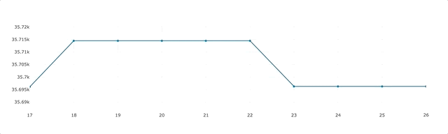

# Bitcoin Price Streaming



## About this app

This app polls kafka every second and uses the data to update the line chart.


## How to run this app

First, clone this repository and open a terminal inside the root folder.

Create and activate a new virtual environment (recommended) by running
the following:

```bash
python3 -m venv myvenv
source myvenv/bin/activate
```

Install the requirements:

```bash
pip install -r requirements.txt
```
Run the app:

```bash
python app.py
```
Open a browser at http://127.0.0.1:8050

## Deploying app to production

```bash
gunicorn -w 3 -b 0.0.0.0:80 app:server
```

## Resources

- To learn more about Dash, check out our [documentation](https://plot.ly/dash).
